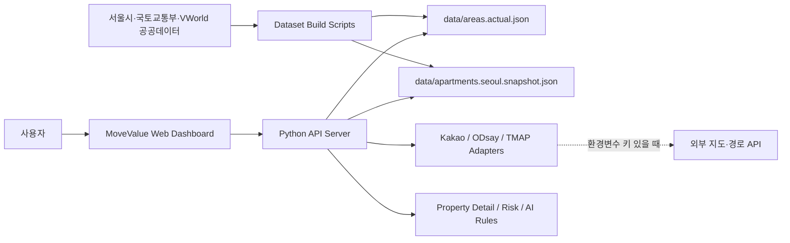

# MoveValue Architecture

이 폴더는 MoveValue의 시스템 아키텍처, 데이터 흐름, 사용자 플로우, API 시퀀스, 배포·보안 기준을 분리해서 정리한다. 공모전 제출·발표·후속 개발자가 같은 구조를 기준으로 설명하고 확장할 수 있도록 Mermaid 다이어그램과 구현 파일 연결을 함께 둔다.

## 문서 목차

| 문서 | 목적 |
| --- | --- |
| [system-architecture.md](system-architecture.md) | 전체 시스템 컨텍스트, 컨테이너, 핵심 컴포넌트 구조 |
| [data-flow.md](data-flow.md) | 공공데이터 수집, 정규화, 런타임 조회, 폴백 데이터 흐름 |
| [user-flows.md](user-flows.md) | 생활권 추천, 지도 대시보드, 통근검증, AI Agent 사용자 흐름 |
| [api-sequences.md](api-sequences.md) | 주요 API 호출 순서와 실패 시 폴백 시퀀스 |
| [deployment-security.md](deployment-security.md) | 로컬 실행, 키 관리, 배포 후보 구조, 보안·법적 제한 |

## 현재 구현 기준

- 웹: [app/index.html](../app/index.html), [app/app.js](../app/app.js), [app/styles.css](../app/styles.css)
- API 서버: [api/movevalue_api.py](../api/movevalue_api.py)
- 경로·주소 어댑터: [api/route_adapters.py](../api/route_adapters.py)
- 아파트 지도 레이어: [api/apartment_adapters.py](../api/apartment_adapters.py)
- 부동산 상세/AI 모델: [api/property_model.py](../api/property_model.py), [api/property_adapters.py](../api/property_adapters.py)
- 데이터셋 생성: [scripts/build_real_dataset.py](../scripts/build_real_dataset.py), [scripts/movevalue_adapters.py](../scripts/movevalue_adapters.py), [scripts/build_apartment_snapshot.py](../scripts/build_apartment_snapshot.py)
- 런타임 데이터: [data/areas.actual.json](../data/areas.actual.json), [data/apartments.seoul.snapshot.json](../data/apartments.seoul.snapshot.json)

## 아키텍처 원칙

1. **실데이터 우선**: 서울시 2025 전월세 실거래 집계와 서울시 공동주택 단지정보를 우선 사용한다.
2. **키 없는 환경 폴백**: Kakao, ODsay, TMAP, 서울 열린데이터 API 키가 없어도 심사·데모가 동작해야 한다.
3. **데이터 진실성 표시**: 화면과 문서에서 `실데이터`, `추정`, `폴백`, `연계 예정`을 구분한다.
4. **API-UI 분리**: iOS/SwiftUI 확장을 위해 웹 UI는 API 응답만 소비하고, 추천·경로·부동산 상세 로직은 서버 모듈에 둔다.
5. **공공데이터 안전성**: 원천 대용량 데이터는 `data/raw/`에만 보관하고 Git에는 커밋하지 않는다.

## 한눈에 보는 구조

## 발표용 핵심 문장

MoveValue는 단순 매물 검색이 아니라 `주거비 + 통근 + 생활 SOC + 안전환경 + 전세 위험 신호`를 통합해 사용자가 "어디에 살지"와 "계약 전 무엇을 확인해야 하는지"를 한 번에 판단하도록 돕는 주거 의사결정 API/웹 플랫폼이다.
