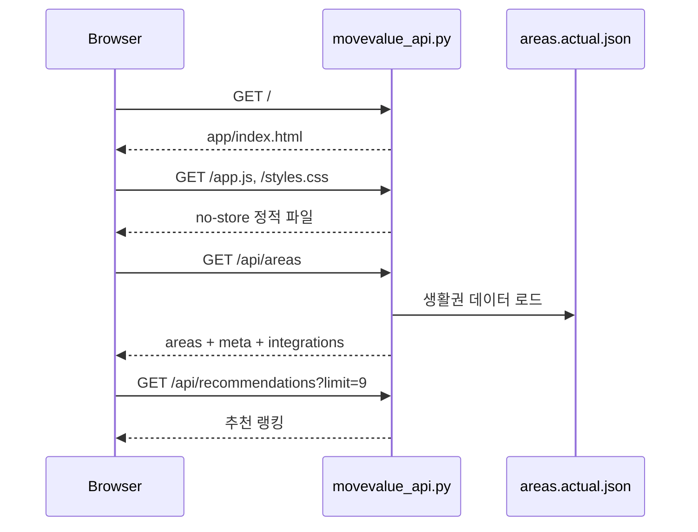
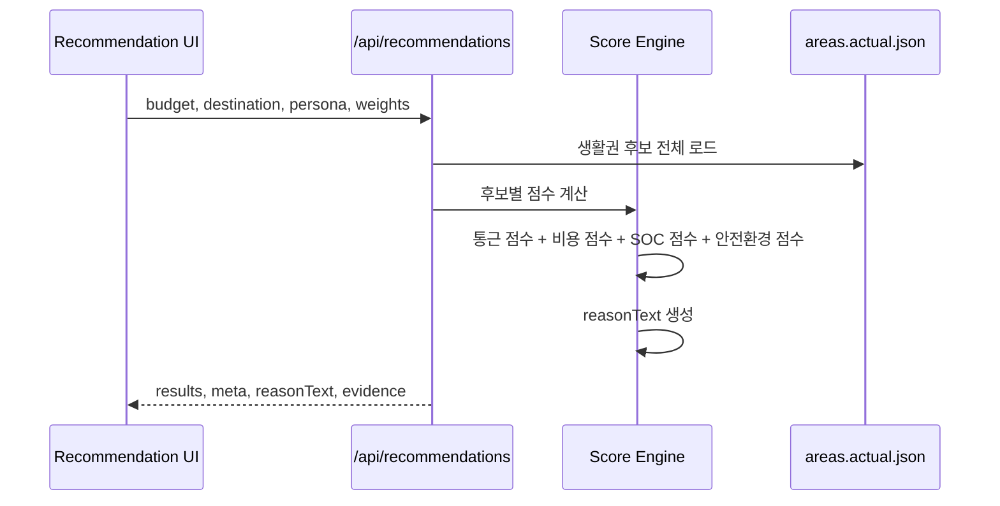
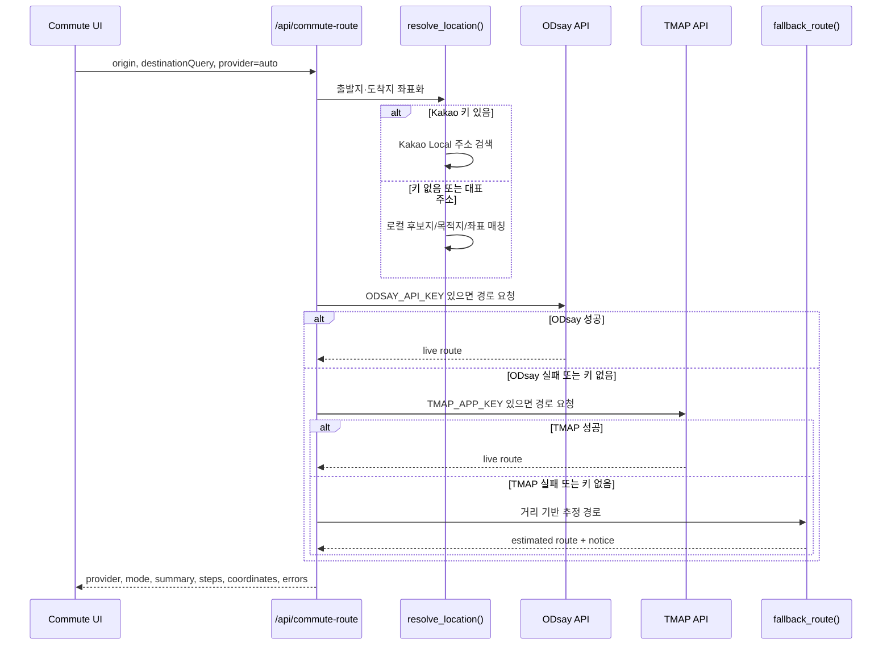
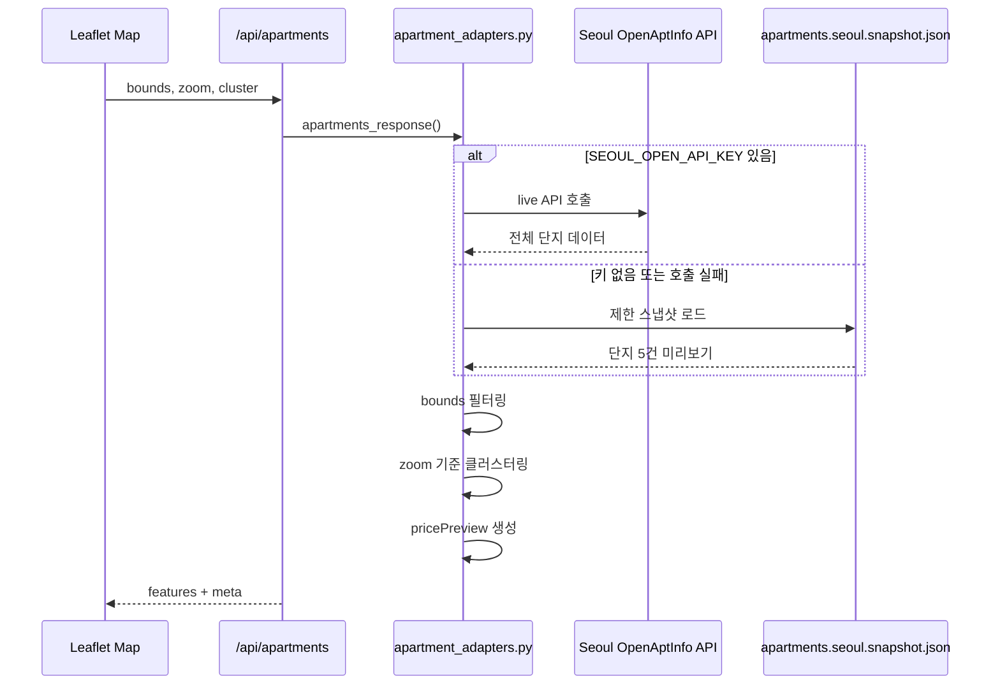
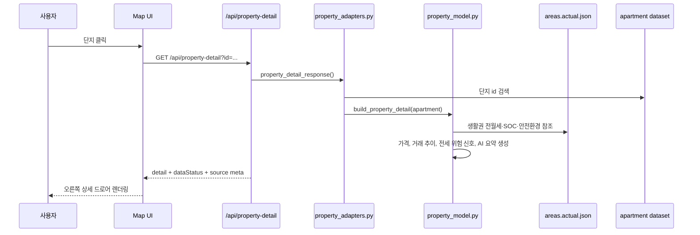
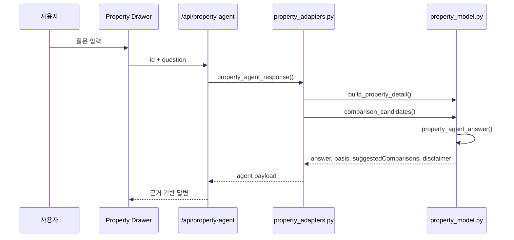
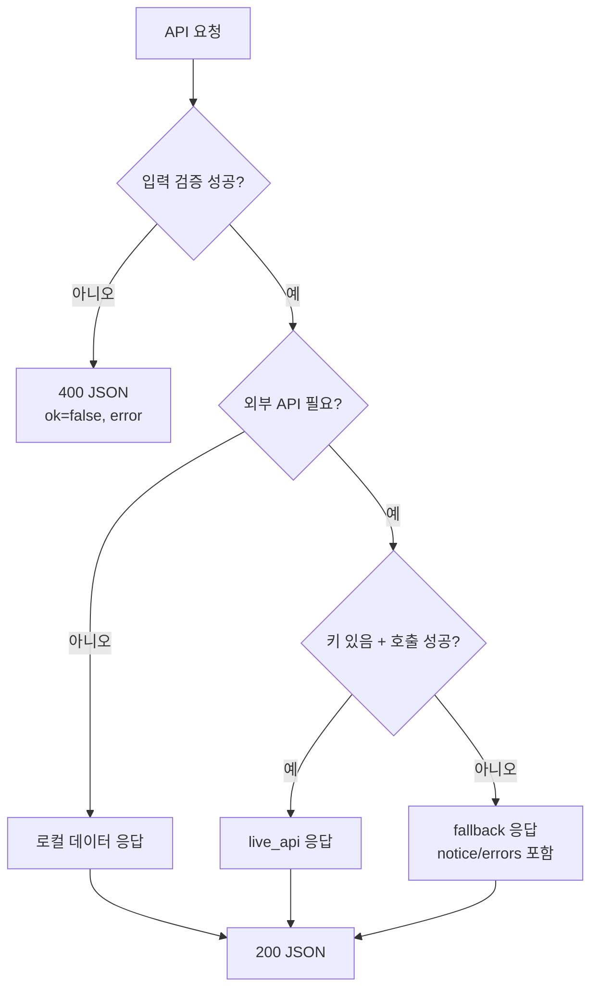

# API Sequences

이 문서는 프론트엔드와 API 서버가 어떤 순서로 통신하는지 정리한다. 모든 API는 현재 `python3 api/movevalue_api.py --port 5173` 서버에서 제공된다.

## Initial Page Load

## Recommendation Request

## Commute Route With Fallback

## Apartment Map Layer

## Property Detail Dashboard

## Property Agent

## Endpoint Contract Summary

| Endpoint | 입력 | 출력 | 폴백 |
| --- | --- | --- | --- |
| `/api/health` | 없음 | 데이터 로딩 상태, API 키 감지 여부 | 없음 |
| `/api/areas` | 없음 | 생활권 원천 데이터 | `areas.actual.json` 필수 |
| `/api/recommendations` | 예산, 목적지, 가구 유형, 가중치 | 생활권 랭킹과 근거 | 데이터셋 기반 |
| `/api/geocode` | 주소/후보지/좌표 | 좌표 객체 | 로컬 대표 주소, 좌표 파싱 |
| `/api/commute-route` | 집, 회사, provider | 통근 루트 요약과 단계 | 거리 기반 추정 |
| `/api/apartments` | bounds, zoom, cluster | 단지/클러스터 feature | 스냅샷 |
| `/api/property-detail` | id 또는 q | 상세 대시보드 | 단지 스냅샷 + 추정값 |
| `/api/property-agent` | id, question | 답변, 근거, 비교 후보 | 내부 규칙 기반 |

## Error Handling Policy

외부 API 실패는 사용자 경험을 끊지 않고 `provider`, `mode`, `notice`, `errors`, `dataStatus` 필드로 한계를 공개한다.
