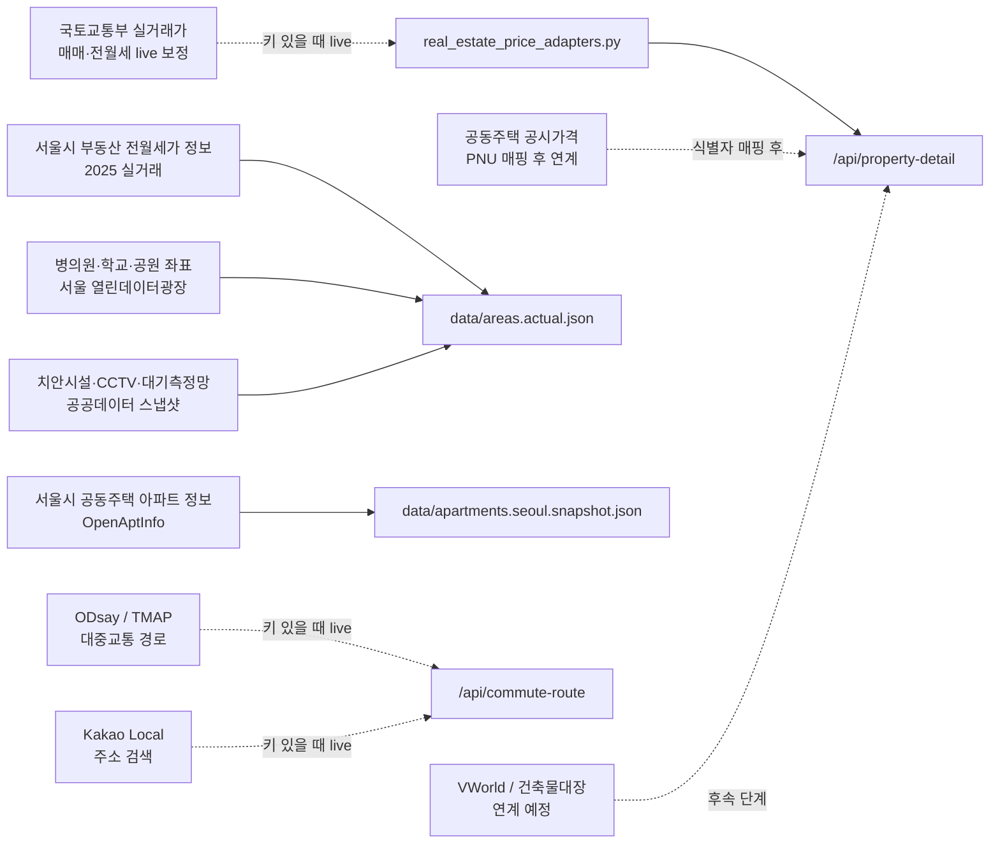
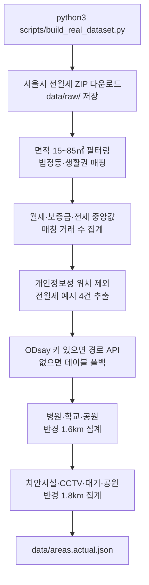
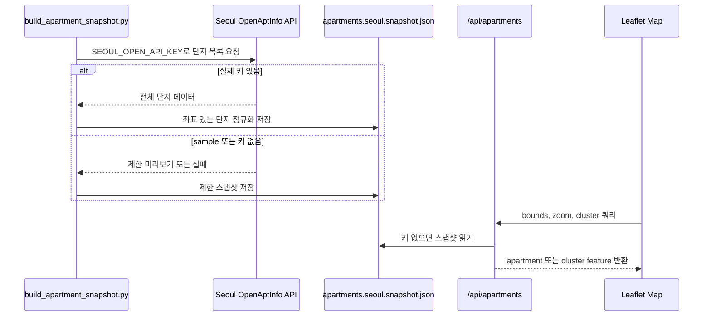
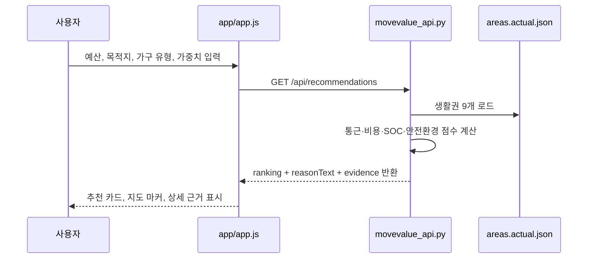
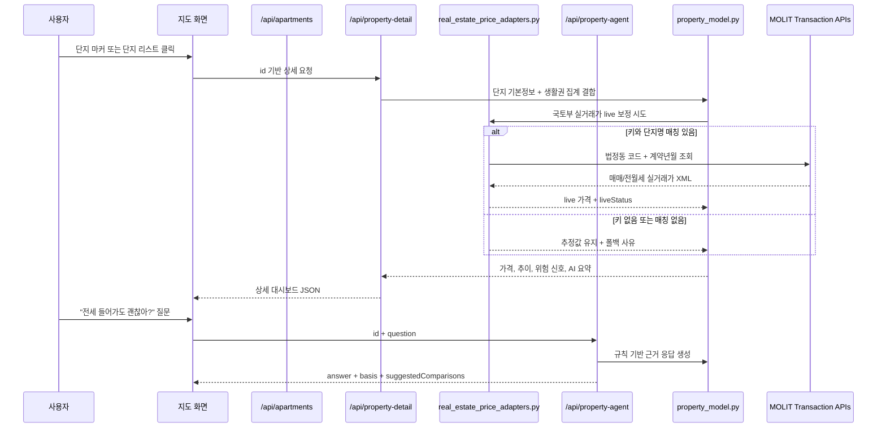
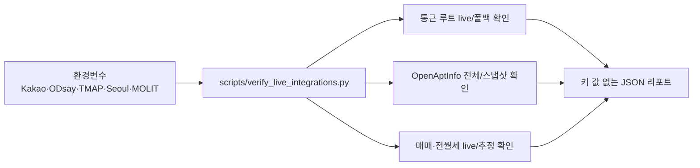
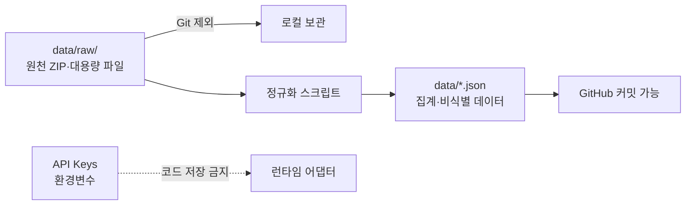

# Data Flow

MoveValue의 데이터 흐름은 `오프라인 데이터 구축`과 `런타임 API 조회`로 나뉜다. 대용량 원천 파일과 API 키는 저장소에 남기지 않고, 정규화된 프로토타입 데이터만 커밋한다.

## Data Source Map

## Offline Build Flow

## Apartment Layer Flow

## Runtime Recommendation Flow

## Runtime Property Detail Flow

## Data Truth Matrix

| 데이터 | 현재 상태 | 화면 표기 |
| --- | --- | --- |
| 생활권 월세·보증금·전세 중앙값 | 서울시 2025 전월세 실데이터 집계 | 실데이터 |
| 전월세 예시 | 서울시 2025 전월세 공개파일에서 상세 위치 제거 후 추출 | 실거래 예시 |
| 생활 SOC | 병의원·학교·공원 좌표 스냅샷 반경 집계 | 공공데이터 기반 |
| 안전·환경 | 치안시설·CCTV·대기측정망·공원 접근성 스냅샷 | 공공데이터 기반 |
| 통근시간 추천 점수 | ODsay 어댑터 우선, 키 없으면 테이블 폴백 | live 또는 폴백 |
| 사용자 통근 루트 | Kakao/ODsay/TMAP 키 있으면 live, 없으면 거리 추정 | live 또는 추정 |
| 아파트 단지 기본정보 | OpenAptInfo live 또는 스냅샷 | 실데이터/제한 스냅샷 |
| 매매·전월세 단지 가격 | 국토교통부 키 있으면 live 보정, 없거나 단지명 매칭 실패 시 생활권 기반 추정 | live 또는 추정 |
| 공시가격·거래 추이 | 공시가격 PNU 매핑 전 생활권 집계 기반 추정 | 추정/연계 예정 |
| 등기부 권리관계 | 자동 수집하지 않음 | 사용자 확인 필요 |

## Live Verification Flow

## Privacy and Storage Boundary

`data/raw/`는 `.gitignore`에 등록된 원천 데이터 영역이다. 사용자·신청자 개인정보, API 키, 상세 지번·건물명 등 민감하거나 재배포 위험이 있는 값은 커밋 대상이 아니다.
