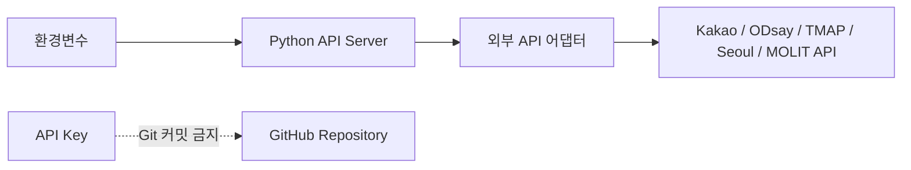
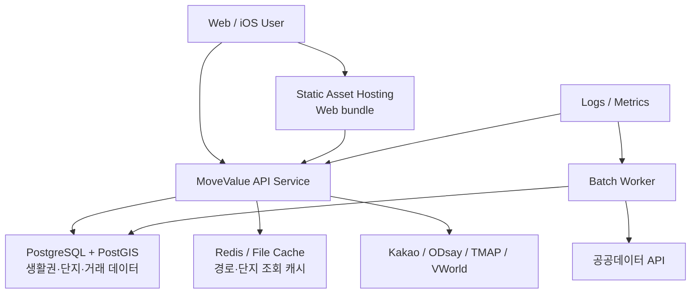
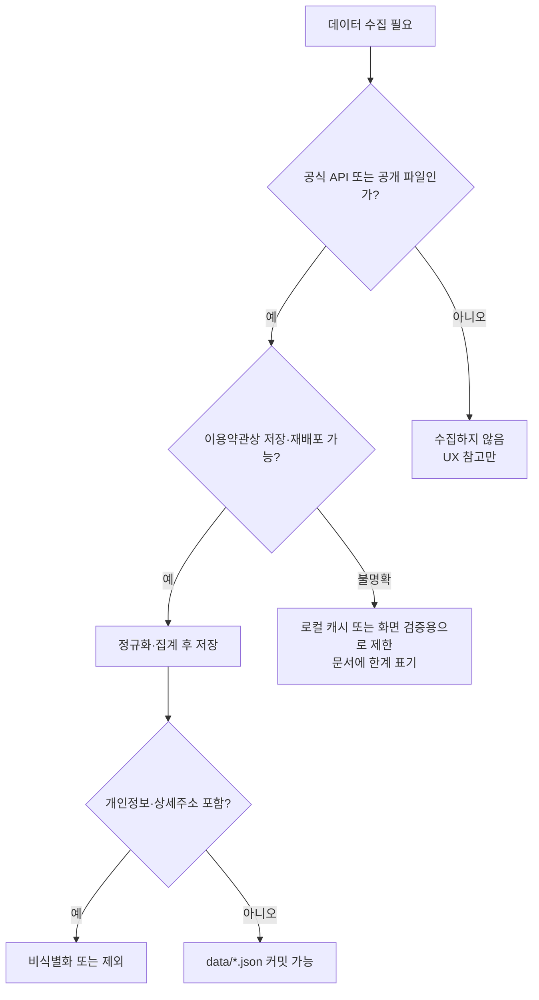
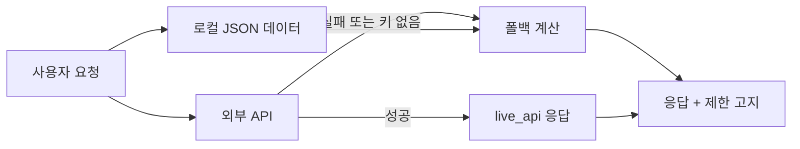
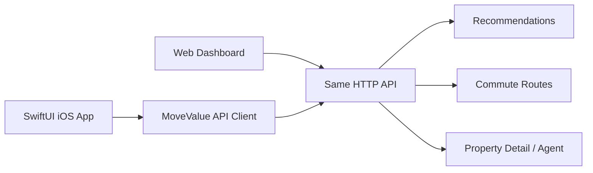

# Deployment and Security

MoveValue는 현재 로컬 실행 가능한 공모전 프로토타입이지만, API/데이터 계층을 분리해 배포와 모바일 앱 확장으로 넘어갈 수 있게 설계한다.

## Local Runtime

```bash
python3 api/movevalue_api.py --port 5173
```

브라우저 접속:

```text
http://127.0.0.1:5173/
http://127.0.0.1:5173/#map
```

외부 패키지 없이 Python 표준 라이브러리만 사용한다. 심사 환경에서 재현성을 높이기 위한 선택이다.

## Environment Variables

| 환경변수 | 목적 | 저장소 저장 여부 |
| --- | --- | --- |
| `KAKAO_REST_API_KEY` 또는 `MOVEVALUE_KAKAO_REST_API_KEY` | 상세 주소 검색 | 저장 금지 |
| `ODSAY_API_KEY` 또는 `MOVEVALUE_ODSAY_API_KEY` | 대중교통 경로 live 검증 | 저장 금지 |
| `TMAP_APP_KEY` | TMAP 대중교통 경로 live 검증 | 저장 금지 |
| `SEOUL_OPEN_API_KEY`, `SEOUL_API_KEY`, `MOVEVALUE_SEOUL_OPEN_API_KEY` | 서울 OpenAptInfo 전체 단지 조회 | 저장 금지 |
| `MOLIT_SERVICE_KEY`, `MOLIT_APT_TRADE_KEY`, `MOLIT_APT_RENT_KEY`, `PUBLIC_DATA_API_KEY` | 국토교통부 매매·전월세 실거래가 live 보정 | 저장 금지 |
| `PUBLIC_PRICE_API_KEY`, `OFFICIAL_PRICE_API_KEY`, `MOLIT_PUBLIC_PRICE_KEY`, `NSDI_API_KEY` | 공동주택 공시가격/PNU 매핑 후 보정 | 저장 금지 |
| 향후 `VWORLD_API_KEY` | 지오코딩·용도지역·공간정보 | 저장 금지 |



## Deployment Candidate



### 단계별 이전

| 단계 | 목표 | 변경점 |
| --- | --- | --- |
| 현재 | 로컬 프로토타입 | JSON 파일 + Python 서버 |
| 1단계 | 심사 데모 안정화 | API 키 운영, 호출 캐시, 데이터 갱신 로그 |
| 2단계 | 데이터 확장 | SQLite 또는 PostgreSQL/PostGIS 도입 |
| 3단계 | 서비스 배포 | API 서버 분리, 정적 웹 호스팅, 작업 큐 |
| 4단계 | iOS 앱 | SwiftUI 앱이 동일 API 소비 |

## Security Rules

1. API 키는 코드, 문서, 커밋, 스크린샷에 저장하지 않는다.
2. 원천 대용량 파일은 `data/raw/`에만 두고 Git에 올리지 않는다.
3. 사용자 입력 주소는 추천·경로 계산에만 사용하고 프로토타입에서는 저장하지 않는다.
4. 부동산 위험도는 법적 판단이 아니라 데이터 기반 `위험 신호 점검`으로만 표현한다.
5. 네이버부동산, 호갱노노, 직방, 다방 등 민간 서비스는 UX 레퍼런스로만 참고하고 무단 스크래핑하지 않는다.
6. 공공데이터도 재배포 조건을 확인하고, 원천 그대로가 아니라 집계·정규화 데이터 중심으로 저장한다.

## Legal and Data Boundary



## Availability Strategy



외부 API가 없어도 핵심 데모가 깨지지 않도록 추천, 지도, 상세 대시보드, AI Agent는 로컬 데이터 기반으로 동작한다. live API는 정확도를 높이는 플러그인 계층으로 취급한다.

## Operational Checklist

- `node --check app/app.js`
- `python3 -m json.tool data/areas.actual.json`
- `python3 -m json.tool data/apartments.seoul.snapshot.json`
- `python3 -m py_compile api/movevalue_api.py api/route_adapters.py api/apartment_adapters.py api/property_model.py api/property_adapters.py api/real_estate_price_adapters.py scripts/build_real_dataset.py scripts/movevalue_adapters.py scripts/build_apartment_snapshot.py scripts/verify_live_integrations.py`
- `python3 scripts/verify_live_integrations.py`
- `git diff --check`
- `GET /api/health`에서 키 감지 여부와 데이터 상태 확인
- 브라우저 `#map`에서 생활권 마커, 아파트 가격 마커, 단지 상세 드로어 확인

## Future iOS Boundary



iOS 앱은 지도/폼/상세 화면만 네이티브로 만들고, 추천·경로·부동산 위험 신호 계산은 동일 API를 호출하는 구조가 적합하다. 이 방식이면 웹과 모바일의 데이터 근거가 어긋나지 않는다.
