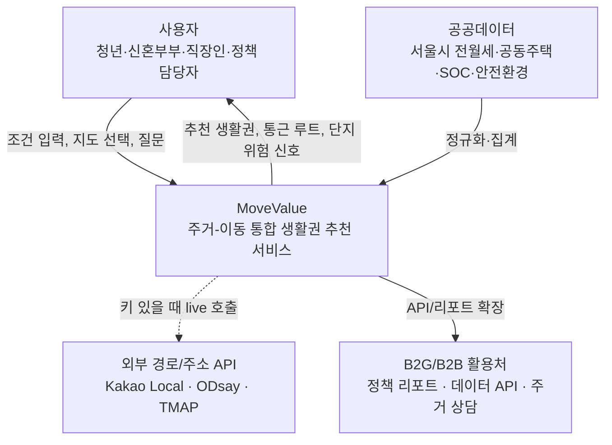
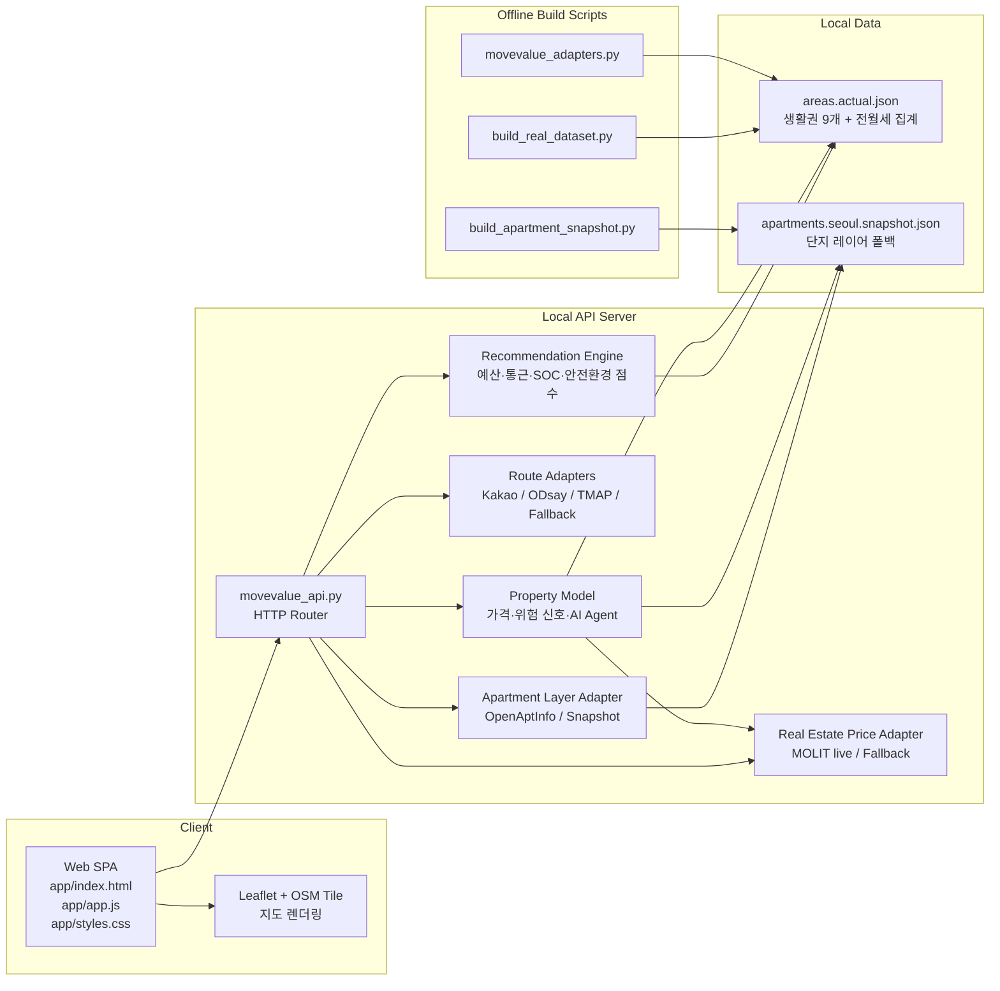
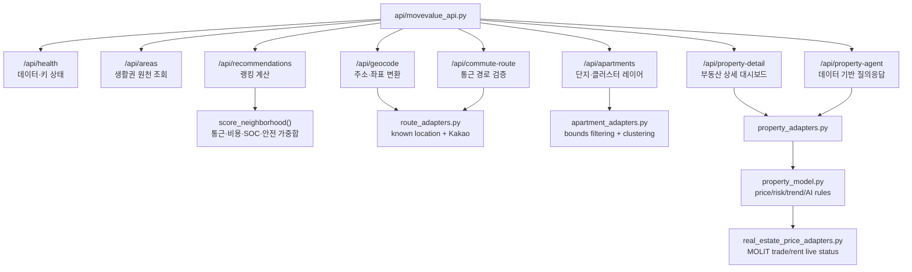
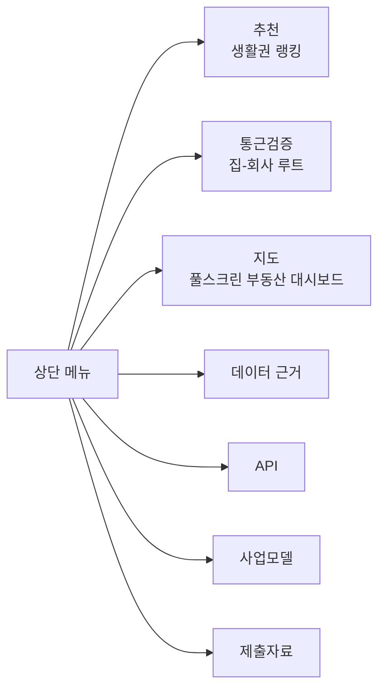
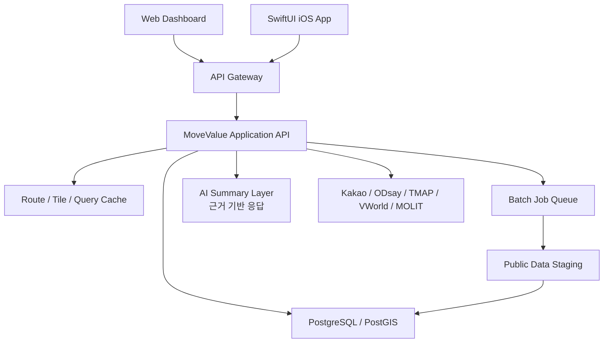

# System Architecture

MoveValue는 현재 외부 패키지 없는 Python 표준 라이브러리 API 서버와 브라우저 SPA로 구성된 프로토타입이다. 핵심 계산은 서버에 두고, 웹은 지도·대시보드·입력 UX를 담당한다.

## System Context

## Container Diagram

## Component Diagram

## 화면 구조

`#map` 화면은 `body.is-map-view` 상태에서 전역 헤더·내비게이션·푸터를 숨기고, 왼쪽 사이드바와 오른쪽 전체 지도 캔버스를 보여준다. 이는 부동산 지도 서비스처럼 지도 탐색을 첫 화면 경험으로 만들기 위한 구조다.

## 책임 분리

| 계층 | 책임 | 주요 파일 |
| --- | --- | --- |
| Web UI | 입력 상태, 탭 전환, 지도 마커, 상세 패널, 반응형 렌더링 | `app/app.js`, `app/styles.css` |
| API Router | 정적 파일 서빙, 엔드포인트 라우팅, JSON 응답 | `api/movevalue_api.py` |
| Recommendation | 생활권 점수, 추천 사유 문장, 가중치 계산 | `api/movevalue_api.py` |
| Route/Geocode | 주소 좌표화, 대중교통 live API, 거리 기반 폴백 | `api/route_adapters.py` |
| Apartment Layer | 단지 API 호출, 스냅샷 폴백, 클러스터링, 가격 미리보기 | `api/apartment_adapters.py` |
| Price Live Adapter | 국토교통부 매매·전월세 실거래가 조회, 단지명 매칭, live/폴백 상태 | `api/real_estate_price_adapters.py` |
| Property Detail | 가격 추정/live 보정, 거래 추이, 전세 위험 신호, 계약 체크리스트, AI Agent 규칙 | `api/property_model.py`, `api/property_adapters.py` |
| Data Build | 전월세 집계, SOC·안전환경 집계, 단지 스냅샷 생성 | `scripts/` |
| Verification | 키 기반 live API와 폴백 상태 검증 | `scripts/verify_live_integrations.py` |

## 확장 목표 구조

현재 저장소는 위 확장 구조로 옮기기 전에 API 계약과 화면 UX를 검증하는 실작동 프로토타입이다.
