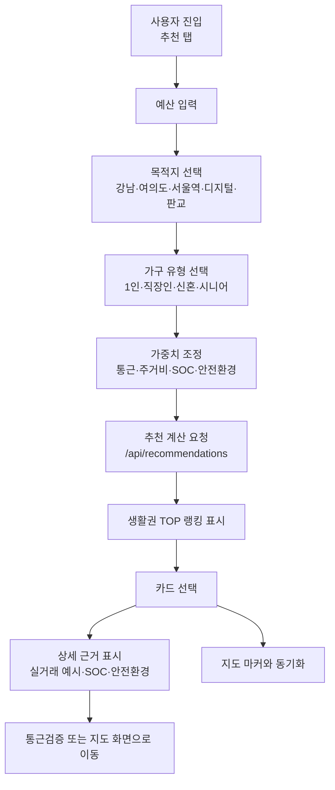
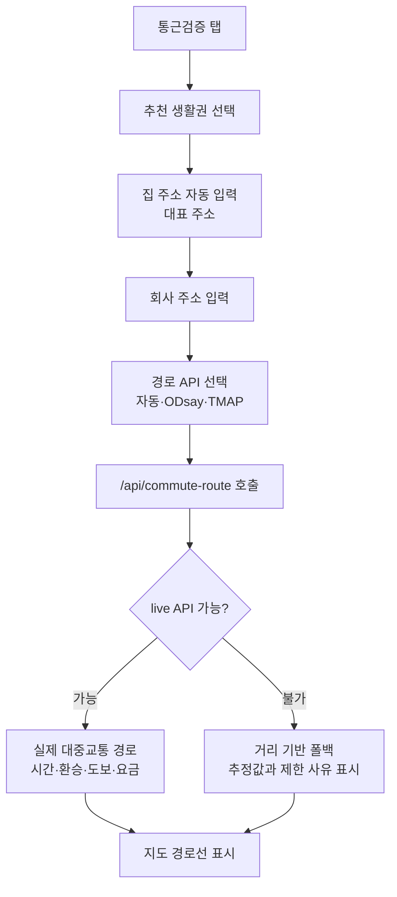
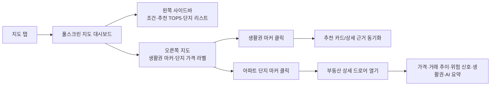
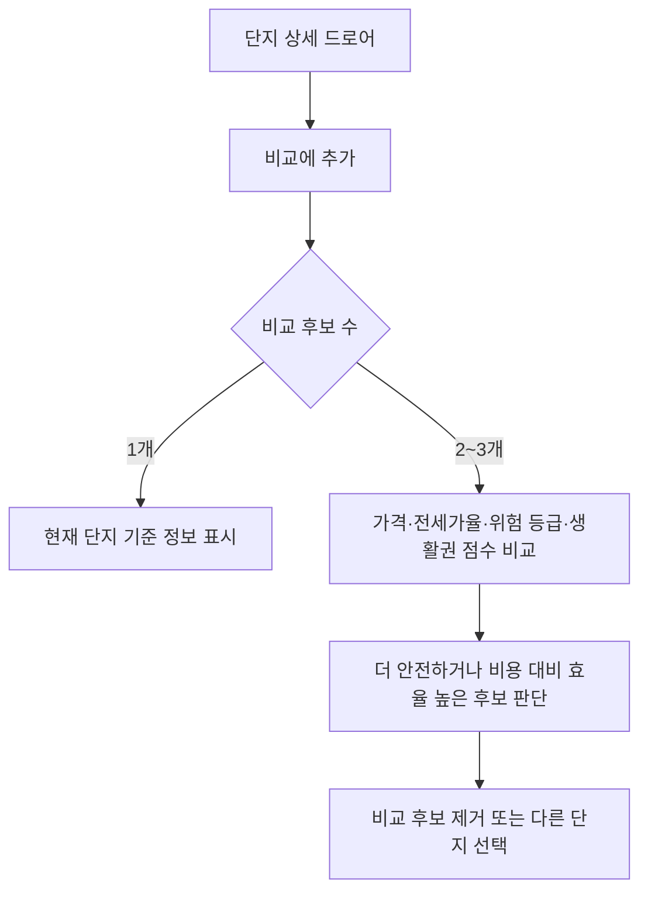
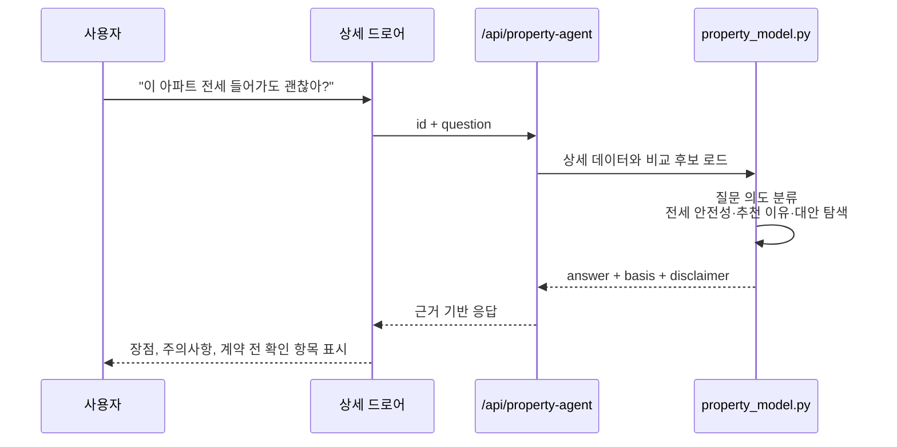
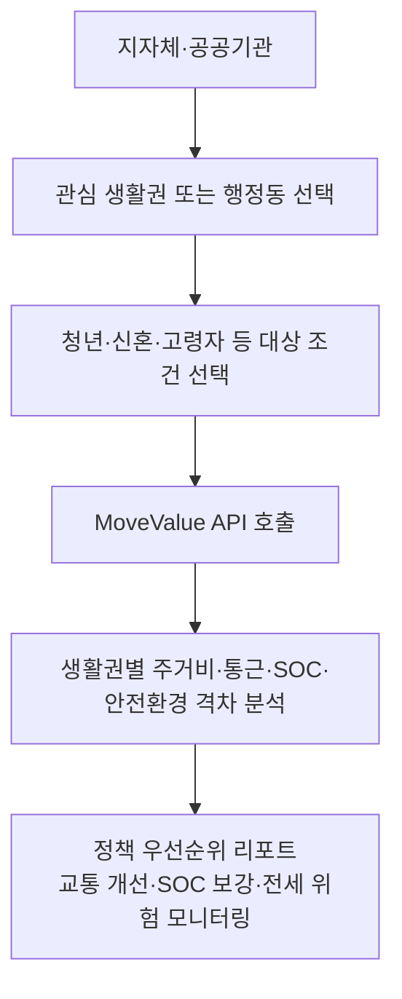

# User Flows

이 문서는 MoveValue의 핵심 사용자 흐름을 발표와 QA 기준으로 정리한다. 현재 구현은 웹 대시보드 중심이며, 같은 API를 iOS 앱에서 재사용할 수 있게 설계했다.

## Flow 1. 생활권 추천

### 성공 기준

- 추천 카드에 추상 문구가 아니라 통근시간, 월세, 병원·학교·공원, 치안시설·CCTV 수치가 표시된다.
- 카드 우측 점수 중심 UI보다 순위와 근거 문장이 먼저 보인다.
- API 키가 없어도 추천 결과가 렌더링된다.

## Flow 2. 통근 루트 검증

### 성공 기준

- 기본 집 위치는 좌표가 아니라 실제 주소로 보인다.
- Kakao/ODsay/TMAP 키는 환경변수로만 사용한다.
- live 경로가 불가능하면 실패 화면 대신 폴백 결과와 제한 사유를 표시한다.

## Flow 3. 지도 기반 부동산 대시보드

### 성공 기준

- 지도는 카드 안 작은 이미지가 아니라 참고 부동산 서비스처럼 화면 중심이 된다.
- 단지 마커는 가격 미리보기와 위험 신호 톤을 보여준다.
- 단지 클릭 시 상세 드로어가 열리고 지도 탐색 맥락이 유지된다.

## Flow 4. 단지 비교

### 성공 기준

- 후보는 최대 3개까지 유지해 모바일 화면에서도 비교가 무너지지 않는다.
- 비교표는 단순 시세가 아니라 전세 위험 신호와 생활권 정보를 함께 보여준다.

## Flow 5. AI Agent 질의응답

### 답변 원칙

- 법적 판정처럼 말하지 않는다.
- `위험 신호 점검`, `계약 전 확인 필요`, `주의 요소` 같은 표현을 사용한다.
- 가격, 통근, 생활 SOC, 안전환경, 주변 비교를 근거로 함께 제시한다.

## Flow 6. 정책·B2G 리포트 확장

### 차별점

네이버부동산, 직방, 다방이 매물 검색 중심이라면 MoveValue는 생활권 추천과 전세 위험 신호를 API·정책 리포트로 확장할 수 있다.
