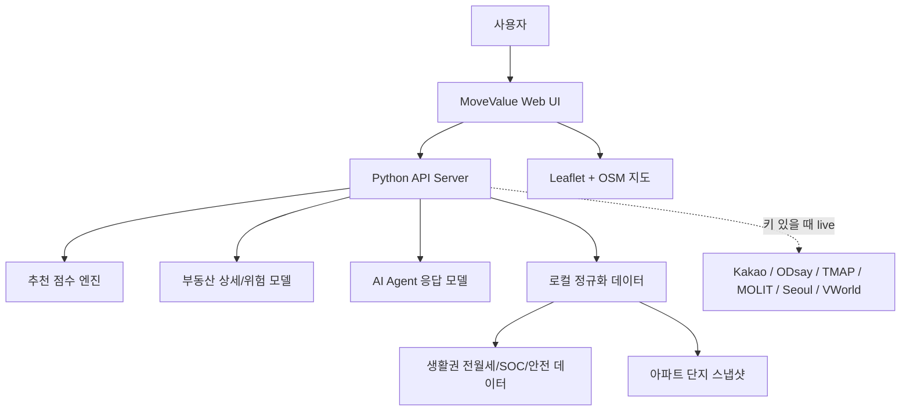
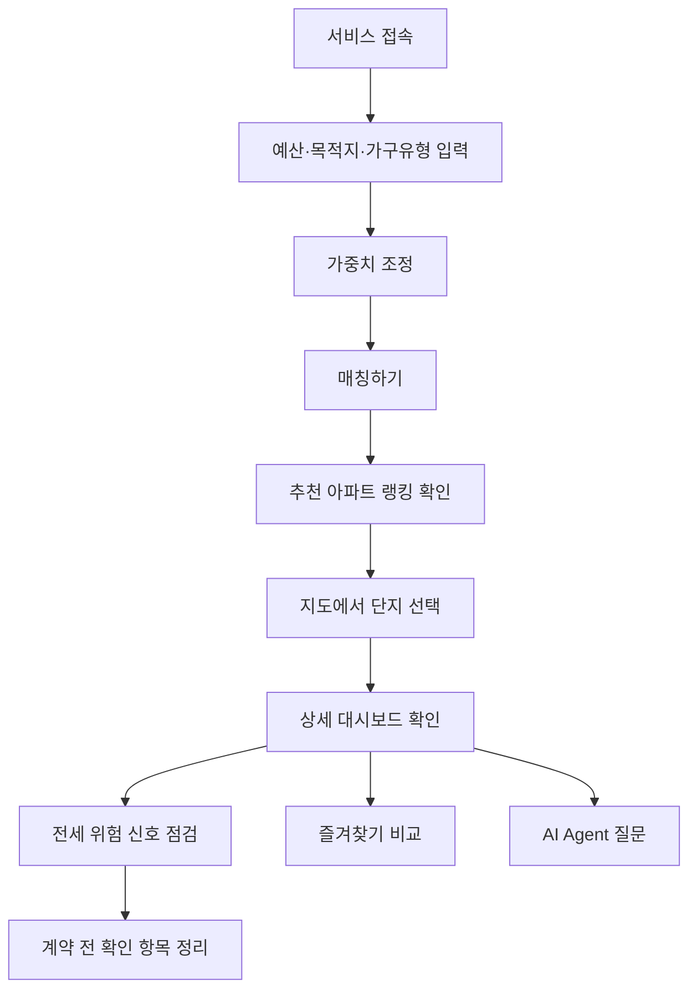
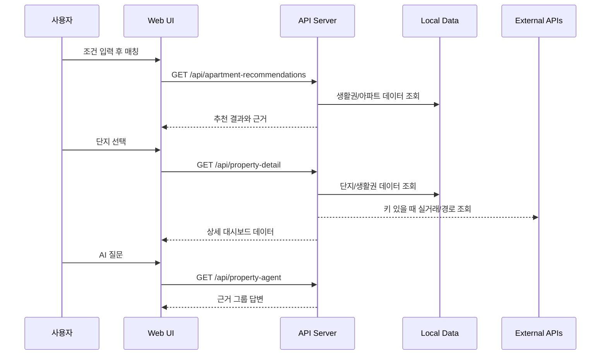
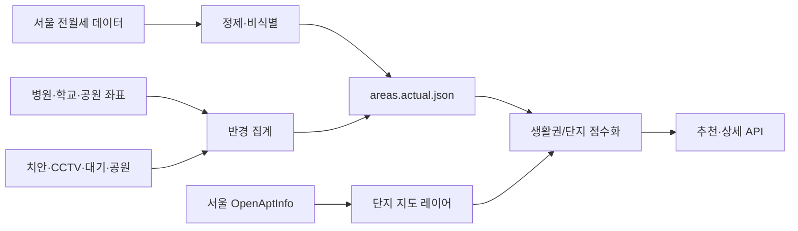
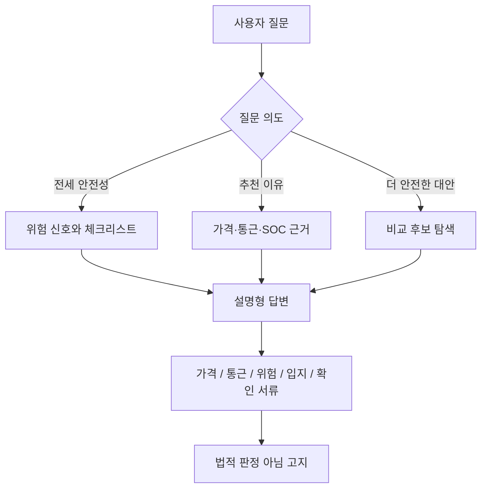
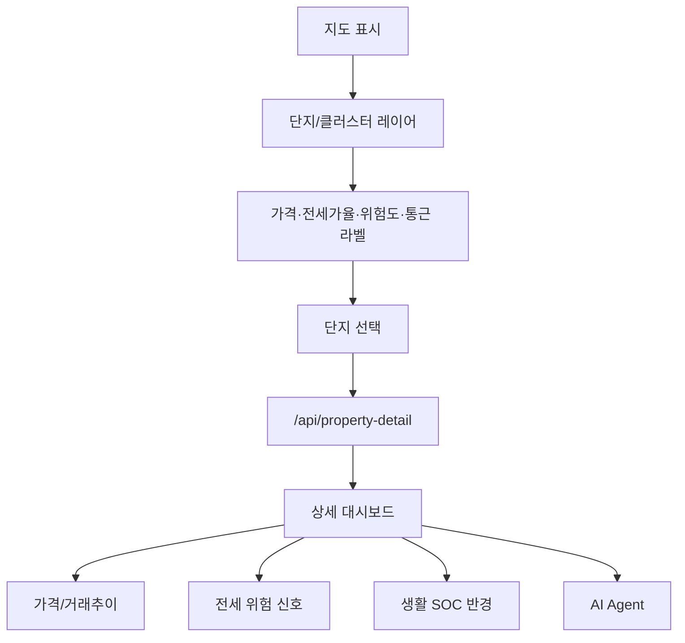
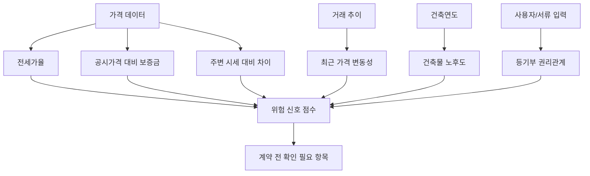
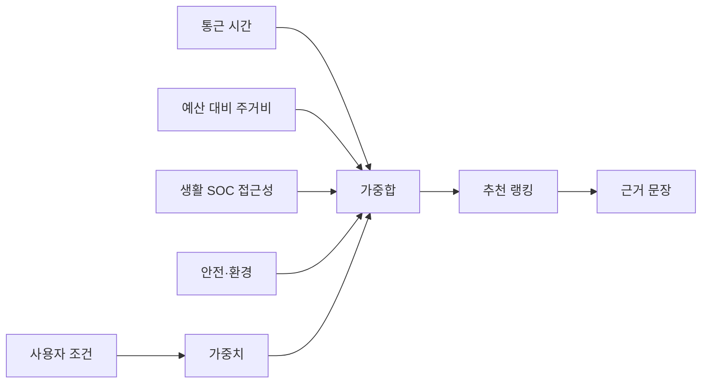
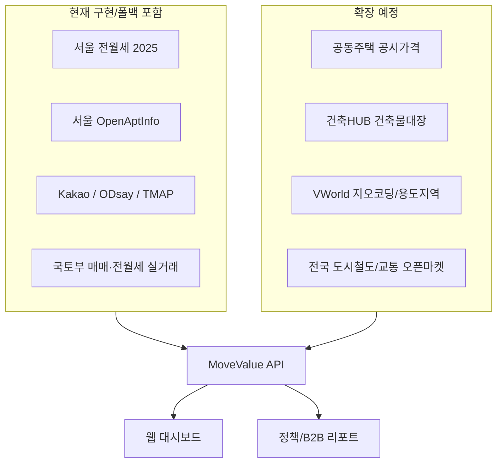

# 참가신청서 삽입용 Mermaid 다이어그램

각 다이어그램은 신청서 본문 또는 발표자료에 붙여넣기 쉽도록 핵심 흐름 중심으로 작성했다.

## 1. 전체 시스템 아키텍처 다이어그램

MoveValue가 사용자, 웹 UI, API 서버, 로컬 데이터, 외부 공공 API를 어떻게 연결하는지 보여준다.

## 2. 사용자 플로우 다이어그램

사용자가 조건 입력부터 단지 비교와 계약 전 확인까지 이동하는 흐름이다.

## 3. 서비스 시퀀스 다이어그램

추천과 상세 대시보드가 어떤 API 호출 순서로 구성되는지 보여준다.

## 4. 데이터 파이프라인 다이어그램

공공데이터를 수집하고 점수화하는 흐름이다.

## 5. AI Agent 의사결정 흐름도

AI Agent가 질문을 근거 기반 답변으로 바꾸는 방식이다.

## 6. 지도 기반 부동산 대시보드 기능 흐름도

지도 마커 클릭부터 상세 패널이 열리는 흐름이다.

## 7. 전세 위험 신호 점검 프로세스

법적 판정이 아닌 계약 전 주의 요소 안내 프로세스다.

## 8. 생활권 점수 산정 구조도

추천 점수가 어떤 항목으로 산정되는지 보여준다.

## 9. 공공데이터/API 연계 구조도

현재 구현된 API와 확장 예정 API를 한 번에 보여준다.

